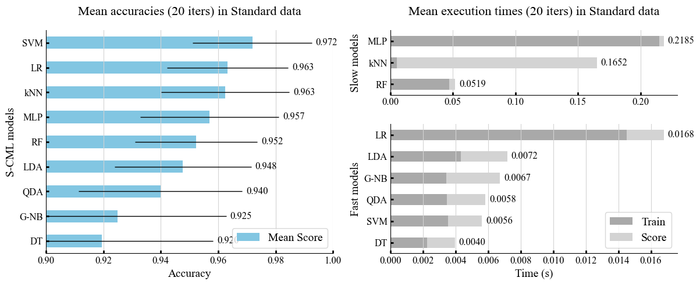

# Master Thesis Project

Sport Activity Classification Using Classical Machine Learning and Time Series Methods

## Python environment dependencies

### Python version 3.8.16

**channels:**
- defaults

**dependencies:**
- ipykernel
- pandas
- seaborn
- scikit-learn
- threadpoolctl
- python=3.8
- numpy
- jinja2
- sktime
- tqdm

## Testing environment
Lenovo Yoga

## Jupyter Notebooks with preview are available in Kaggle

* Part 1: https://www.kaggle.com/code/jarnomatarmaa/masterprojectcode-cml
* Part 2: https://www.kaggle.com/code/jarnomatarmaa/masterprojectcode-tsc
* Part 3: https://www.kaggle.com/code/jarnomatarmaa/masterprojectcode-sac-analysis

Unfortunately, GitHub does not support Jupyter Notebook preview

## Study pipeline

## Adopted models

### Sklearn
- k-Nearest Neighbors (kNN)
- Gaussian Naive Bayes (G-NB)
- Quadratic Discriminant Analysis (QDA)
- Logistic Regression (LR)
- Support Vector Machine (SVM)
- Decision Tree (DT)
- Random Forest (RF)
- Multilayer Perceptron (MLP)
- Linear Discriminant Analysis (LDA)

### Sktime
- Time Series Forest Classifier (TSF)
- Supervised Time Series Forest (STSF)
- Random Interval Spectral Ensemble (RISE)
- Random Interval Classifier (RIC)
- Shapelet Transform Classifier (STC)
- KNeighbors Time Series Classifier (kNN-TS)
- Composable Time Series Forest Classifier (CTSF)
- WEASEL
- HIVE-COTEv1.0
- MUSE
- Column Ensemble (STSF-STSF-RIC)

## Main results of the study

### Standard Classical Machine Learning (S-CML)

### Univariate and Multivariate Time Series Classification (U-TSC and M-TSC)

